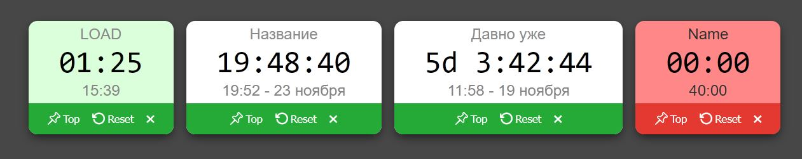
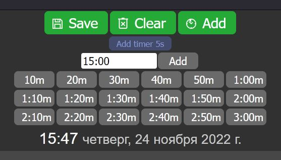
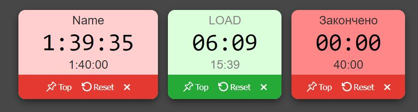

# 🕑Timer - секундомеры и таймеры

## [Demo](https://devmikealex.github.io/Timer/)

На странице проекта можно создавать секундомеры и таймеры. По окончании таймера будет воспроизведен короткий звук. Таймеры отличаются от секундомеров красным фоном. Под временем в индивидуальном блоке подсчета дополнительно выводится информация о времени старта (для секундомера) или начальное значение таймера. После создания нового таймера/секундомера можно сразу ввести его имя.



Таймер с именем "**LOAD**" считается служебным и игнорируется при сохранении настроек. Он подсвечивается зеленым задним фоном и создается автоматически каждый раз при загрузке страницы.

## Описание и особенности

- Создание секундомеров и таймеров
- Отсчет идет даже без загруженной страницы
- Вывод информации из первого таймера в заголовок страницы
- Сохранение данных в **localStorage** или в буфер обмена ОС
- Импорт данных из текста
- Большой диапазон отсчета может включать дни
- Мигающее состояние законченного таймера

## Технологии проекта

- JavaScript
- ООП / классы
- HTML
- CSS / LESS / BEM
- Flexbox
- JSDoc

## Интерфейс



### Общие кнопки

- **Save** - Сохранить/импортировать настройки (см.ниже)
- **Clear** - Удалить все настройки из localStorage, после перезагрузки будет только один отсчет **LOAD**, создаваемый автоматически.
- **Add** - Добавить секундомер отсчета времени. После создания можно сразу ввести новое имя.

### Серый блок кнопок

Серый блок служит для быстрого создания предустановленных таймеров или ввода таймкода до срабатывания вида 00:00:00:00 (дни:часы:минуты:секунды). Необязательно использовать все группы времени, например, дни или часы.

### Блоки времени



Для редактирования названия нужно щелкнуть мышкой на заголовок. Нажатие клавиши **ENTER** завершает редактирование. После редактирования при необходимости нужно сохранить настройки, иначе изменения пропадут при перезагрузке страницы.

- **Top** - переместить таймер в первую позицию (для вывода нужной информации в заголовке страницы).
- **Reset** - перезапустить отсчет времени.
- Кнопка удаление таймера в виде крестика.

Когда таймер завершится, будет воспроизведен короткий звук и время 00:00 начнет мигать для привлечения внимания. Это состояние сохраняется до тех пор, пока не будет осуществлен клик кнопкой мыши на значении времени.

## Сохранение, импорт, экспорт настроек

### Дополнительные возможности кнопки **Save**

- Простой клик ЛКМ - сохранить настройки в **localStorage** в переменную `timers`.
- С кнопкой **Alt** - сохранить строкой в буфер обмена для импорта.
- С кнопкой **Control** - записать данные в localStorage напрямую из поля ввода таймкода.

### **Импорт**

Поместить строку с информацией в поле ввода для таймкода, нажать кнопку **Save** с зажатым **Control**, для применения изменений нужно перезагрузить страницу браузера.

Пример строки с настройками, полученной из буфера:

```json
[{"name":"Test","root":"root","pause":false,"secCount":0,"startTime":"2022-11-23T20:45:11.430Z","forward":true,"endTimeSec":0,"alarmDone":false},{"root":"root","name":"спать","pause":false,"secCount":0,"startTime":"2022-11-23T16:52:19.155Z","forward":true,"endTimeSec":0,"alarmDone":false},{"root":"root","name":"Уехали","pause":false,"secCount":0,"startTime":"2022-11-19T08:58:14.891Z","forward":true,"endTimeSec":0,"alarmDone":false},{"forward":false,"endTimeSec":2400,"root":"root","name":"Name","pause":false,"secCount":0,"startTime":"2022-11-23T18:33:42.815Z","alarmDone":true}]
```
